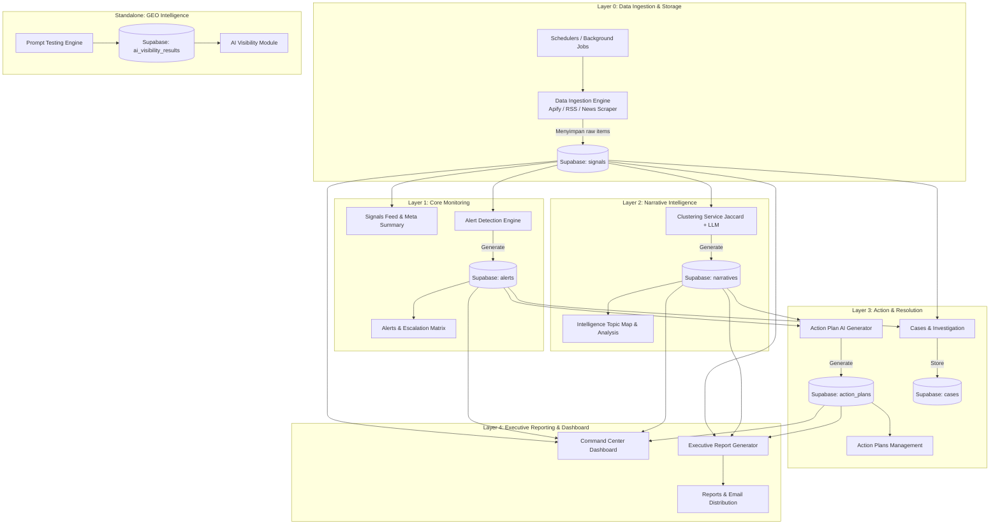

# NARRIV DEVELOPMENT ROADMAP
**Dokumen Strategis Pengembangan & Prioritisasi Produk**  
*Tanggal: 16 September 2026*  
*Dasar Acuan: [narriv-state-review-2026-09-14.md](file:///Users/mac/Desktop/MyThings/Work/narriv/docs/product-review/narriv-state-review-2026-09-14.md) & [qa-phase1-fix-retest-2026-09-14.md](file:///Users/mac/Desktop/MyThings/Work/narriv/docs/product-review/qa-phase1-fix-retest-2026-09-14.md)*  
*Status: DRAFT FOR REVIEW (Belum Dieksekusi)*

---

## 1. Executive Summary

Saat ini, Narriv memiliki fondasi UI modern dan modul **Action Plans** yang terbukti solid dengan integrasi OpenAI riil, namun kredibilitas produk secara keseluruhan masih terancam oleh fitur yang berstatus **DUMMY total** (ketiadaan data ingestion live, AI Visibility tanpa data riil, dan histori investigasi kosong) serta **PARTIAL** dengan ketergantungan pada data sintetis repetitif. Meskipun perbaikan terhadap 4 blocker utama (Alert 404, Narrative Modal 500, Case Creation 500, dan mismatch Workspace ID) telah diverifikasi pada branch perbaikan lokal, kode di branch utama masih memerlukan konsolidasi. Target akhir dari roadmap ini adalah mentransformasi Narriv dari prototipe visual yang rapuh menjadi platform intelijen reputasi enterprise yang utuh dan bernilai jual tinggi, di mana siklus inti produk—**Monitor Signals, Understand Narratives, dan Take Action**—berjalan secara otomatis, terintegrasi penuh ke database Supabase, didukung ingestion live yang efisien, serta menyajikan estimasi GEO (Generative Engine Optimization) yang kredibel dan dapat dipertanggungjawabkan di hadapan calon klien.

---

## 2. Dependency Map (Peta Ketergantungan Modul)

Sistem Narriv dibangun di atas aliran data berjenjang. Kegagalan atau ketiadaan data di lapisan bawah (Ingestion) secara langsung melumpuhkan keaslian modul di atasnya (Signals, Alerts, Intelligence, Reports).



### Tabel Matriks Ketergantungan

| Modul | Kategori Kematangan | Ketergantungan Langsung (*Upstream*) | Modul yang Bergantung Padanya (*Downstream*) | Dampak Jika Upstream Mati/Dummy |
|---|---|---|---|---|
| **Data Ingestion** | **DUMMY** | Scraper API (Apify/RSS), Scheduler/Cron, Supabase DB | Signals, Alerts, Intelligence, Dashboard, Reports | Seluruh sistem terpaksa menggunakan mock data statis Juli 2026. |
| **Signals** | **PARTIAL** | Data Ingestion, AI Sentiment Service | Alerts Engine, Narrative Clustering, Cases, Dashboard, Reports | Konten kartu sinyal seragam, tidak ada sentimen real-time baru. |
| **Alerts** | **PARTIAL** | Signals, Rule/Anomaly Engine | Action Plans, Cases, Dashboard, Reports | Tidak ada alert baru yang terpicu secara otomatis dari lonjakan isu. |
| **Intelligence** | **PARTIAL** | Signals, Clustering Service (OpenAI) | Action Plans, Dashboard, Reports | Klaster topik beku; tidak bisa mendeteksi pergeseran tren isu baru. |
| **Action Plans** | **SOLID** | Alerts, Narratives, OpenAI GPT-4o-mini | Dashboard, Reports | Saat ini sudah berjalan mandiri, namun input masih bergantung data seed. |
| **Cases** | **DUMMY / FIX PENDING** | Signals, Alerts, Auth/User System | Reports, Activity Logs | Alur eskalasi penanganan krisis putus jika pembuatan case error. |
| **Reports** | **PARTIAL** | Signals, Narratives, Action Plans, Resend/SMTP | Stakeholder Management | AI Summary menjadi teks palsu; pengiriman email gagal terkirim. |
| **Command Center** | **PARTIAL** | Seluruh data agregat (Signals, Alerts, Narratives) | Executive User Experience | Metrik snapshot kompetitor dan status sistem fallback ke nilai fiktif. |
| **AI Visibility (GEO)** | **DUMMY** | Engine Multi-LLM / OpenAI Modeling, Supabase DB | Standalone (Opsional: Threat Alerting) | Grafik dan sitasi 100% fiktif dari file mock; klaim multi-LLM tidak nyata. |

---

## 3. Roadmap Bertahap (Fase per Fase)

Roadmap ini dirancang dalam **5 fase terstruktur** yang menyeimbangkan antara kecepatan kesiapan demo (*quick credibility*), penyelesaian dependensi data (*data pipeline reality*), serta diferensiasi produk enterprise.

```
┌─────────────────────────────────────────────────────────────────────────┐
│ Fase 1: Stabilization & Demo-Credibility Foundation (Quick Kills)       │
├─────────────────────────────────────────────────────────────────────────┤
│ Fase 2: Core Data Ingestion & Live Pipeline (Nafas "Monitor Signals")   │
├─────────────────────────────────────────────────────────────────────────┤
│ Fase 3: Automated Intelligence & Action Closed-Loop                     │
├─────────────────────────────────────────────────────────────────────────┤
│ Fase 4: Realitas AI Visibility (GEO Engine) & Diferensiasi Pasar        │
├─────────────────────────────────────────────────────────────────────────┤
│ Fase 5: Production Hardening, Multi-Tenancy & Integrations              │
└─────────────────────────────────────────────────────────────────────────┘
```

---

### FASE 1: Stabilization & Demo-Credibility Foundation
* **Tujuan Utama:** Mengeliminasi seluruh broken flow, memformalisasi integrasi bug fix dari branch QA, menghapus teks placeholder dummy yang kentara, dan merapikan konsistensi UI/UX agar produk 100% siap didemokan ke calon klien tanpa celah kecacatan visual.
* **Modul / Isu yang Dikerjakan:**
  1. *Merge & Konsolidasi Fix Blocker Demo:* Integrasi resmi fix dari branch `fix/phase1-demo-blockers` (Alert Detail 404, Narrative Modal Failure, Case Creation 500 & UUID sanitization, penyelarasan `DEMO_WORKSPACE_ID`).
  2. *Data Realism Refresh:* Mengganti 30 teks sinyal berulang (*"This is a sample signal content..."*) dengan narasi isu perbankan/fintech Indonesia yang realistis, serta mengganti nama kompetitor `"CompetitorA/B/C"` dengan entitas riil (BCA, Mandiri, BRI).
  3. *Eliminasi Bilingual Bleed:* Menyelaraskan seluruh label bahasa Indonesia yang terselip di login (`"Tampilkan kata sandi"`), pagination (`"Ke halaman sebelumnya..."`), integrasi (`"Putus integrasi Slack"`), dan view switcher agar konsisten 100% bahasa Inggris.
  4. *CSS & Usability Polish:* Memperbaiki z-index modal Create Alert dan memberikan state visual/tooltip yang jelas pada tombol disabled (Filter Reports, Run AI Simulation).
* **Alasan Prioritas:** Ini adalah prasyarat mutlak sebelum Narriv dipresentasikan ke pihak eksternal. Biayanya murni teknis (effort rendah, zero third-party cost), tetapi dampaknya langsung mengamankan reputasi dan kredibilitas produk.
* **Perkiraan Effort:** **Small (S)**
* **Definisi "Selesai":**
  - Alur demo dari Login Demo -> Dashboard -> Signals -> Alerts -> Alert Detail -> Intelligence -> Narrative Detail -> Action Plans -> Create Case berjalan tanpa ada satu pun halaman 404, modal error, maupun console crash.
  - Data yang tampil di layar terlihat otentik, profesional, dan relevan dengan industri target tanpa ada teks placeholder pengembang.
* **Flag Eksekusi:**
  - ✅ **Boleh Langsung Dieksekusi:** Seluruh perbaikan teknis kode, merge fix blocker, pembersihan CSS z-index, perbaikan string terjemahan, dan pembaruan data seed sinyal & kompetitor di database.
  - ⚠️ **Perlu Didiskusikan Dulu:** Pemilihan industri skenario demo resmi (rekomendasi: Kasus Krisis Reputasi Perbankan/Fintech Nasional vs FMCG).

---

### FASE 2: Core Data Ingestion & Live Pipeline (Nafas "Monitor Signals")
* **Tujuan Utama:** Mengaktifkan aliran data dinamis dari dunia nyata ke dalam Narriv, sehingga sistem tidak lagi bersifat museum data statis Juli 2026.
* **Modul / Isu yang Dikerjakan:**
  1. *Ingestion Engine Terjadwal:* Menghubungkan scraper berita online (Google News RSS / Portal Berita Nasional) untuk memantau keyword brand secara otomatis ke tabel `signals`.
  2. *Live Ingestion On-Demand:* Menyediakan tombol aksi *"Fetch Latest Signals"* di UI (halaman Sources atau Signals) yang dapat memicu scraping langsung saat presentasi interaktif dengan klien.
  3. *AI Signal Processing Pipeline:* Mengganti string template sintetis di `/signals/meta` dan fungsi analisis sinyal dengan pemanggilan OpenAI GPT-4o-mini untuk ekstraksi sentimen, ringkasan, dan intensitas bahaya riil.
  4. *Worker / Queue Architecture:* Mengaktifkan mekanisme background queue yang efisien (menentukan antara BullMQ + Redis atau serverless cron Supabase).
* **Alasan Prioritas:** Value proposition pertama Narriv adalah *"Monitor Signals"*. Jika sistem tidak dapat menarik percakapan atau berita terbaru, seluruh modul analitik lanjutan di atasnya kehilangan relevansi operasional.
* **Perkiraan Effort:** **Medium (M)**
* **Definisi "Selesai":**
  - Pengguna dapat memasukkan satu keyword brand baru, menekan tombol sync, dan dalam hitungan detik muncul 5-10 artikel/sinyal riil dari media internet ke dalam tabel `signals` lengkap dengan analisis sentimen otomatis dari LLM.
* **Flag Eksekusi:**
  - ✅ **Boleh Langsung Dieksekusi:** Pembuatan RSS/News crawler adapter, penggantian endpoint `/signals/meta` dengan prompt GPT-4o-mini, dan skema database untuk `ingestion_jobs`.
  - ⚠️ **Perlu Didiskusikan Dulu:**
    1. *Cost Implication Scraping:* Pemilihan provider scraping berbayar (Apify untuk X/Instagram/TikTok) vs scraping berita publik gratis (RSS/Google News).
    2. *Infrastruktur Queue:* Menentukan apakah akan menyewa instans Redis (Upstash) untuk BullMQ atau memanfaatkan cron internal Supabase PostgreSQL (`pg_cron`).

---

### FASE 3: Automated Intelligence & Action Closed-Loop
* **Tujuan Utama:** Menyambungkan data sinyal riil ke pembentukan narasi otomatis, deteksi anomali krisis, dan eskalasi langsung ke rencana aksi (menyempurnakan trilogi: *Monitor -> Understand -> Take Action*).
* **Modul / Isu yang Dikerjakan:**
  1. *Dynamic Narrative Clustering:* Menjalankan background clustering berbasis Jaccard + LLM auto-labeling setiap kali ada batch sinyal baru yang terkumpul, memperbarui kartu narasi di Topic Map secara real-time.
  2. *Automated Alert Rules Engine:* Membangun rule engine sederhana yang otomatis menerbitkan `alerts` baru ketika rasio sentimen negatif melonjak atau volume sinyal melebihi ambang batas (*spike detection*).
  3. *Action Plan & Incident Escalation Link:* Menghubungkan Alert atau Case langsung ke AI Action Plan Generator dengan injeksi konteks sinyal spesifik (bukan form kosong).
  4. *True AI Executive Report & Email Delivery:* Mengganti string template palsu pada laporan krisis dengan analisis situasi riil berbasis LLM, serta mengonfigurasi Resend API untuk pengiriman laporan PDF/ringkasan ke email pemangku kepentingan.
* **Alasan Prioritas:** Mengubah Narriv dari sekadar *"alat monitoring kliping berita"* menjadi *"crisis response platform"* yang bernilai ratusan juta rupiah bagi tim Public Relations dan Corporate Communications enterprise.
* **Perkiraan Effort:** **Large (L)**
* **Definisi "Selesai":**
  - Ketika terjadi simulasi lonjakan sinyal negatif, sistem otomatis memunculkan Alert di notification bar, mengelompokkannya menjadi klaster narasi baru di Intelligence, dan pengguna dapat mengeklik *"Respond with Action Plan"* untuk menghasilkan mitigasi krisis lengkap yang langsung siap diunduh sebagai PDF atau dikirim via email.
* **Flag Eksekusi:**
  - ✅ **Boleh Langsung Dieksekusi:** Pipeline clustering otomatis, pembuatan Action Plan berdasar ID Alert/Signal, integrasi prompt LLM untuk Executive Report Summary.
  - ⚠️ **Perlu Didiskusikan Dulu:**
    1. *Penyedia Email Transaksional:* Pendaftaran akun dan penyediaan domain terverifikasi untuk Resend/SendGrid API key.
    2. *Threshold Alert Anomali:* Penentuan parameter ambang batas sensitivitas eskalasi krisis yang disepakati secara produk.

---

### FASE 4: Realitas AI Visibility (GEO Engine) & Diferensiasi Pasar
* **Tujuan Utama:** Mengonversi modul AI Visibility dari data statis/mock 100% menjadi kapabilitas Generative Engine Optimization (GEO) yang otentik, terukur, dan dapat dipertanggungjawabkan di hadapan klien enterprise.
* **Modul / Isu yang Dikerjakan:**
  1. *GEO Testing Engine:* Mengimplementasikan arsitektur prompt testing yang mengevaluasi bagaimana AI menjawab pertanyaan terkait reputasi brand, persepsi produk, dan kompetitor.
  2. *Database Persistence:* Menyimpan hasil running pengujian dan riwayat prompt ke tabel `prompt_test_runs` dan `ai_visibility_results` di Supabase.
  3. *Citation & Source Extraction:* Membangun ekstraksi domain sitasi (mengidentifikasi website mana yang paling sering dikutip oleh mesin AI saat menyebut brand).
  4. *Sandbox Simulation Interaktif:* Mengaktifkan form *"Run AI Simulation"* di frontend sehingga klien dapat mengetikkan pertanyaan bebas dan melihat evaluasi visibilitas secara dinamis.
* **Alasan Prioritas:** AI Visibility adalah diferensiasi utama Narriv di pitch deck. Ditempatkan di Fase 4 agar tidak memblokir perbaikan fungsi reputasi konvensional (Fase 1-3), namun diselesaikan sebelum pitching intensif ke klien tier-1.
* **Perkiraan Effort:** **Medium to Large (M-L)**
* **Definisi "Selesai":**
  - Pengguna dapat menjalankan simulasi prompt di halaman AI Visibility, sistem mencatat hasil evaluasi ke database Supabase riil, dan grafik tren serta daftar sitasi web diperbarui berdasarkan output analisis aktual.
* **Flag Eksekusi:**
  - ✅ **Boleh Langsung Dieksekusi:** Pembuatan skema integrasi database ke `prompt_test_runs`, aktivasi tombol sandbox di frontend, dan logika parsing sitasi domain.
  - ⚠️ **Perlu Didiskusikan Dulu (STRATEGIS & BIAYA):**
    1. *Metodologi Multi-LLM:* Apakah menggunakan pendekatan **Single-Engine Modeling** (simulasi cerdas berbasis OpenAI GPT-4o-mini dengan transparansi metodologi di UI) ATAU **True Multi-API Integration** (berlangganan langsung API Google Gemini, Anthropic Claude, dan Perplexity API yang memiliki implikasi biaya bulanan tinggi).

---

### FASE 5: Production Hardening, Multi-Tenancy & Integrations
* **Tujuan Utama:** Menyiapkan arsitektur Narriv untuk peluncuran komersial multi-klien yang aman, terisolasi secara mandiri, dan terintegrasi dengan ekosistem enterprise.
* **Modul / Isu yang Dikerjakan:**
  1. *Pemisahan Demo vs Production Workspace:* Mengganti percabangan `isDemoMode()` di kode frontend dengan arsitektur multi-tenant sejati (akun demo diberikan workspace sandbox terisolasi di database Supabase).
  2. *Integrasi Notifikasi Eksternal:* Mengaktifkan webhook pengiriman alert krisis langsung ke kanal Slack dan Microsoft Teams perusahaan.
  3. *Ekspor Data Lanjutan:* Menambahkan kemampuan ekspor laporan dan tabel sinyal ke format Excel (XLSX) dan CSV selain PDF.
  4. *Audit & Penguatan Keamanan RLS:* Pengujian penetrasi internal dan audit Row Level Security (RLS) PostgreSQL untuk menjamin tidak ada kebocoran data antar-workspace organisasi.
* **Alasan Prioritas:** Menjamin skalabilitas, stabilitas, dan keamanan jangka panjang saat Narriv mulai melakukan onboarding pengguna berbayar.
* **Perkiraan Effort:** **Medium (M)**
* **Definisi "Selesai":**
  - Klien baru dapat mendaftar sendiri, membuat workspace terisolasi, menghubungkan webhook Slack tim mereka, dan menggunakan Narriv tanpa ada sisa artefak kode demo.
* **Flag Eksekusi:**
  - ✅ **Boleh Langsung Dieksekusi:** Refactoring clean-up `isDemoMode()`, penambahan export CSV/XLSX, dan pengetatan RLS policy.
  - ⚠️ **Perlu Didiskusikan Dulu:** Integrasi skema pembayaran (Stripe / Midtrans) dan penentuan kuota penggunaan per paket langganan.

---

## 4. Prioritas Fase 1 (Immediate Next Steps) — Breakdown Detail

Bagian ini merupakan **spesifikasi kerja langsung** yang akan segera dieksekusi begitu dokumen roadmap ini disetujui. Fase-fase berikutnya akan di-breakdown dengan kedalaman yang sama saat gilirannya tiba.

### Work Package 1.1: Konsolidasi & Merge Fix Blocker Demo
* **Tujuan:** Memindahkan perbaikan demo blocker yang telah lolos uji dari branch `fix/phase1-demo-blockers` ke branch kerja utama.
* **Item Pekerjaan Spesifik:**
  1. *Review & Rebase/Merge Branch:* Mengintegrasikan 4 commit perbaikan:
     - `d709847`: Penanganan rute detail alert `/alerts/[id]` agar membaca data demo secara elegan tanpa memunculkan 404 / "Warning not found".
     - `468e306`: Perbaikan query relasi cluster narasi pada `narratives.routes.js` (menghapus join fiktif `analyses(*)`) dan penyediaan data sentimen breakdown pada modal "See Full Analysis".
     - `e9fc12c`: Perbaikan kolom `signal_id` pada `cases.controller.js`, penyesuaian penanganan `user_id` akun demo pada `audit.js` untuk mencegah exception PostgreSQL `22P02`, serta perlindungan finite number pada fungsi `formatRelativeTime` di frontend.
     - `4a8b0cf`: Penyelarasan konstanta `DEMO_WORKSPACE_ID` ke `56bc14ee-5f16-4134-9828-a240f3c72240` serta penambahan toleransi filter waktu agar query akun demo langsung membaca 30 sinyal, 10 alert, dan 6 narasi riil di database.
  2. *Verifikasi Build:* Menjalankan `npm run lint` dan `npm run build` pada frontend dan backend untuk memastikan tidak ada regresi tipe TypeScript.

### Work Package 1.2: Refresh Data Seed & Eliminasi Teks Placeholder
* **Tujuan:** Menghapus kesan bahwa Narriv menggunakan data tiruan murahan.
* **Item Pekerjaan Spesifik:**
  1. *Update Teks Sinyal di Database Supabase:*
     - Menyiapkan migration SQL atau script pembaruan untuk 30 baris data di tabel `signals`.
     - Mengganti teks repetitif *"This is a sample signal content that would normally come from social media monitoring..."* dengan 30 ragam isu percakapan krisis reputasi yang realistis (misalnya: keluhan kegagalan transfer mobile banking, perbincangan kebijakan privasi data, sentimen merger perbankan, apresiasi inovasi fitur AI bank, dsb.).
  2. *Update Snapshot Kompetitor di Dashboard:*
     - Memperbarui komponen `CompetitorSnapshot` di `frontend/components/dashboard/` dan endpoint `/api/dashboard` agar tidak lagi menggunakan nama fiktif `"CompetitorA"`, `"CompetitorB"`, `"CompetitorC"`.
     - Menggantinya dengan nama institusi finansial/perbankan nasional terkemuka (misal: Bank Mandiri, BCA, BRI, BNI).

### Work Package 1.3: Pembersihan Bilingual Bleed (100% English Consistency)
* **Tujuan:** Menghilangkan kejanggalan campuran bahasa Indonesia-Inggris pada tampilan UI publik dan internal.
* **Item Pekerjaan Spesifik:**
  1. *Login Page:* Ubah tombol toggle visibility password di [LoginForm.tsx](file:///Users/mac/Desktop/MyThings/Work/narriv/frontend/app/(auth)/login/LoginForm.tsx) dari `"Tampilkan kata sandi"` / `"Sembunyikan kata sandi"` menjadi `"Show password"` / `"Hide password"`.
  2. *Pagination Control:* Periksa komponen pagination di tabel Signals dan Reports. Ganti teks aria-label / tooltip `"Ke halaman sebelumnya, halaman X"` dan `"Ke halaman berikutnya, halaman Y"` dengan istilah baku bahasa Inggris (*"Go to previous page"*, *"Go to next page"*).
  3. *Integrations Page:* Ganti teks tombol disconnect pada kartu Slack di `integrations/page.tsx` dari `"Putus integrasi Slack"` menjadi `"Disconnect Slack"`.
  4. *Data Sources View Switcher:* Ganti tooltip tombol grid/list switcher dari `"Tampilkan sumber dalam grid"` menjadi `"Display sources in grid view"`.
  5. *Alerts Error Terminology:* Pastikan pesan error state di modul Alert tidak menerjemahkan Alert menjadi "Warning" (ganti `"Warning not found"` menjadi `"Alert not found"`).

### Work Package 1.4: Perbaikan CSS Stacking & Interaktivitas UI
* **Tujuan:** Menjamin seluruh tombol interaktif dapat diklik tanpa halangan visual dan memberikan feedback yang jelas.
* **Item Pekerjaan Spesifik:**
  1. *Modal Create Alert Stacking Context:* Perbaiki hierarki CSS `z-index` pada dialog modal Create Alert di `frontend/app/(dashboard)/alerts/page.tsx` atau komponen dialog terkait. Pastikan backdrop overlay tidak menutupi container form dan tombol aksi `Cancel` serta `Submit` dapat merespon klik mouse secara presisi.
  2. *Feedback State Tombol Filter Reports:* Pada halaman `reports/page.tsx`, jika tombol "Filter" belum memiliki aksi backend, ubah state-nya menjadi dropdown filter fungsional sederhana (filter berdasarkan tipe: *Executive Brief / Incident / Weekly*) atau berikan visual badge yang elegan.
  3. *Tooltip pada AI Simulation Button:* Pada halaman `ai-visibility/page.tsx`, tambahkan tooltip informatif pada tombol "Run AI simulation" yang menjelaskan prasyarat konfigurasi brand name, atau sediakan pre-filled brand demo sehingga tombol dapat langsung diuji saat demonstrasi.

---

## 5. Ringkasan Eksekusi & Langkah Persetujuan

| Paket Pekerjaan | Prioritas | Perkiraan Waktu | Status Izin Eksekusi |
|---|---|---|---|
| **1.1 Konsolidasi Merge Demo Blockers** | P0 (Kritis) | S (1 - 2 Jam) | **Boleh Langsung Eksekusi** |
| **1.2 Refresh Data Seed & Kompetitor** | P0 (Kritis) | S (2 - 3 Jam) | **Boleh Langsung Eksekusi** |
| **1.3 Pembersihan Bilingual Bleed** | P1 (Tinggi) | S (1 - 2 Jam) | **Boleh Langsung Eksekusi** |
| **1.4 Perbaikan CSS Stacking & Usability** | P1 (Tinggi) | S (2 Jam) | **Boleh Langsung Eksekusi** |

> [!IMPORTANT]
> **Status Tindakan Saat Ini:**
> Dokumen ini disusun sebagai panduan strategis dan **TIDAK ADA perubahan kode aplikasi yang dieksekusi** pada tahap ini.
> Menunggu ulasan dan arahan persetujuan dari pimpinan proyek sebelum melangkah ke eksekusi Fase 1.
