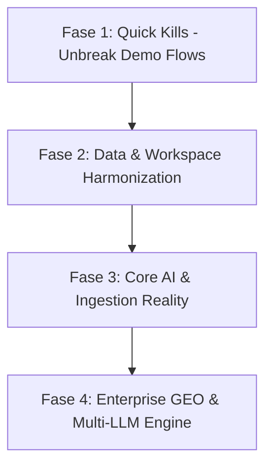

# Laporan Review Menyeluruh Produk Narriv (State of Product Assessment)
**Tanggal Review:** 15 September 2026  
**Penanggung Jawab:** Lead Product & Engineering  
**Tujuan Dokumen:** Gambaran jujur dan obyektif mengenai kondisi menyeluruh Narriv saat ini (Frontend, Backend, Database, AI, Ingestion, dan Integrasi) untuk pelaporan ke manajemen dan penentuan prioritas kerja.

---

## DAFTAR ISI
1. [Ringkasan Eksekutif & Status Modul](#1-ringkasan-eksekutif--status-modul)
2. [Detail Evaluasi per Modul (E2E, Backend, DB, Integrasi)](#2-detail-evaluasi-per-modul)
   - [Modul 1: Authentication & Workspace Scoping](#modul-1-authentication--workspace-scoping)
   - [Modul 2: Command Center (Dashboard)](#modul-2-command-center-dashboard)
   - [Modul 3: Signals & Ingestion](#modul-3-signals--ingestion)
   - [Modul 4: Alerts & Escalation Matrix](#modul-4-alerts--escalation-matrix)
   - [Modul 5: Intelligence (Topic Map & Narrative Clusters)](#modul-5-intelligence-topic-map--narrative-clusters)
   - [Modul 6: AI Visibility (GEO Intelligence)](#modul-6-ai-visibility-geo-intelligence)
   - [Modul 7: Action Plans (Action Center)](#modul-7-action-plans-action-center)
   - [Modul 8: Reports & Executive Summary](#modul-8-reports--executive-summary)
   - [Modul 9: Cases, Data Sources & Integrations](#modul-9-cases-data-sources--integrations)
3. [Audit Integrasi Eksternal & Kecerdasan Buatan (AI)](#3-audit-integrasi-eksternal--ai)
4. [Audit Skema Database & Sinkronisasi Kode](#4-audit-skema-database--sinkronisasi-kode)
5. [Audit Konsistensi UI/UX & Terminologi](#5-audit-konsistensi-uiux--terminologi)
6. [Gap Analisis untuk Enterprise Readiness](#6-gap-analisis-untuk-enterprise-readiness)
7. [Temuan Terprioritas (Prioritized Findings)](#7-temuan-terprioritas)
8. [Rekomendasi Urutan Pengerjaan (Roadmap)](#8-rekomendasi-urutan-pengerjaan)
9. [Hal yang Perlu Didiskusikan (Strategic Decisions)](#9-hal-yang-perlu-didiskusikan)

---

## 1. Ringkasan Eksekutif & Status Modul

Secara keseluruhan, Narriv memiliki pondasi arsitektur yang solid pada antarmuka frontend (Next.js 15) dan Express API dengan skema Supabase PostgreSQL yang matang. Namun, saat ini **terdapat diskoneksi signifikan antara data riil di database dan apa yang ditampilkan di UI**, terutama pada mode demo. 

Banyak modul yang terlihat canggih di UI ternyata masih bergantung pada data mock statis di client-side (`demo-mock-data.ts`), atau mengalami putus sambung API (*404/500 broken flows*) saat tombol interaktif diklik.

### Matriks Status Modul

| Modul | Status | Bukti / Ringkasan Temuan |
|---|:---:|---|
| **Action Plans** | **SOLID** | Generator AI terhubung langsung ke OpenAI GPT-4o-mini (`actions.service.js`), status tersimpan di tabel `action_plans`, transisi Approve/Reject berfungsi dengan audit log riil. |
| **Authentication & Auth Scoping** | **PARTIAL** | Login JWT, hashing bcrypt, dan middleware proteksi berjalan baik. Namun ada mismatch `DEMO_WORKSPACE_ID` antara kode backend (`4c77fd4b...`) dan data seed DB (`56bc14ee...`), menyebabkan akun demo membaca 0 rows dan terpaksa fallback ke client mock. |
| **Command Center (Dashboard)** | **PARTIAL** | Endpoint `/api/dashboard` aktif, namun visual kompetitor masih menampilkan data statis ("CompetitorA/B/C") dan sebagian metrik fallback ke nilai sintetis. |
| **Signals** | **PARTIAL** | Tabel `signals` memiliki 30 data riil di DB, namun teks kontennya adalah seed dummy seragam dari Juli 2026. Tombol "Investigate" ke Cases menghasilkan **Error 500** karena inkonsistensi nama kolom `source_id`. |
| **Alerts** | **PARTIAL (BROKEN DETAIL)** | List alerts dan matrix eskalasi berjalan. Namun saat mengklik detail alert (`/alerts/demo-alert-1`), halaman menampilkan **"Warning not found" (Broken 404)** karena ID mock tidak di-handle oleh API service. Modal "Create Alert" memiliki bug CSS z-index yang menutupi tombol form. |
| **Intelligence** | **PARTIAL (BROKEN DETAIL)** | Backend clustering (Jaccard similarity + OpenAI labeling) ada di kode. Namun di UI demo, mengklik "See Full Analysis" menampilkan modal **"Narrative detail unavailable"** karena API memanggil ID mock ke DB. |
| **Reports** | **PARTIAL** | 3 laporan tersimpan di DB, ekspor PDF/JSON tersedia. Namun badge "AI Report Summary" adalah **teks template interpolasi biasa (bukan LLM)**. Tombol Filter disabled permanen. Fitur kirim email via modal gagal karena provider SMTP/Resend belum dikonfigurasi di backend. |
| **AI Visibility** | **DUMMY / MOCK** | Tabel `ai_visibility_results` di DB berisi **0 rows**. Seluruh grafik tren, skor visibilitas platform, dan sitasi domain (bni.co.id, detik.com) adalah data statis hardcoded. Sandbox "Run AI simulation" ter-disable permanen jika `brandName` belum diatur. Backend hanya mensimulasikan platform non-OpenAI menggunakan 1 prompt GPT-4o-mini. |
| **Cases & Investigations** | **DUMMY / BROKEN** | Tabel `cases` di DB berisi **0 rows**. Pembuatan case dari tombol Investigate gagal dengan status 500 karena query API menyertakan kolom yang tidak ada di DB (`source_id`). |
| **Data Ingestion (Apify)** | **DUMMY / MOCK** | Tidak ada worker / scheduler aktif (`ENABLE_WORKERS=false`, no Redis). Apify tidak memiliki API token di `.env` sehingga otomatis berjalan dalam mode mock (delay 3 detik + return 2 array statis). Tidak ada live crawling media sosial saat ini. |

---

## 2. Detail Evaluasi per Modul

### Modul 1: Authentication & Workspace Scoping
- **Status:** **PARTIAL**
- **Temuan Teknis:**
  1. **Akar Masalah Mismatch Workspace Demo:** Di `backend/src/lib/workspace-access.js`, konstanta `DEMO_WORKSPACE_ID` di-hardcode ke `"4c77fd4b-7dc2-4a9b-be78-f9eee336e042"`. Padahal seluruh data seed di Supabase (`signals`, `alerts`, `narratives`, `action_plans`, `reports`) diisi dengan `workspace_id = "56bc14ee-5f16-4134-9828-a240f3c72240"`.
  2. **Dampak Langsung:** Saat pengguna login menggunakan akun demo, backend query ke DB dengan ID `4c77fd4b...` dan selalu mengembalikan array kosong (0 data). Akibatnya frontend dipaksa mengaktifkan `isDemoMode() = true` dan mengalihkan seluruh tampilan ke file `demo-mock-data.ts`.
  3. **Inkonsistensi Bahasa di Login:** Tombol show password bertuliskan bahasa Indonesia `"Tampilkan kata sandi"`, sementara sisa form berbahasa Inggris (*"Welcome back!", "Remember me", "Forgot password?"*).
- **Screenshot Bukti:** `docs/product-review/screenshots/01-login-page.png`

---

### Modul 2: Command Center (Dashboard)
- **Status:** **PARTIAL / MOCK**
- **Temuan Teknis:**
  1. **Visual Placeholder Kompetitor:** Tabel "Competitor Snapshot" menggunakan nama placeholder mentah: `"CompetitorA"`, `"CompetitorB"`, `"CompetitorC"`. Tidak mencerminkan data intelijen kompetitif riil.
  2. **Ketergantungan Data:** Karena akun demo tidak menemukan data pada workspace-nya, metrik ringkasan dashboard disuplai oleh `getMockDashboardSummary()`.
- **Screenshot Bukti:** 
  - `docs/product-review/screenshots/02-dashboard.png`
  - `docs/product-review/screenshots/02-dashboard-scrolled.png`

---

### Modul 3: Signals & Ingestion
- **Status:** **PARTIAL**
- **Temuan Teknis:**
  1. **Konten Sinyal Sintetis Berulang:** Pada tampilan Signals (`/signals`), seluruh kartu sinyal menampilkan teks deskripsi yang seragam dan repetitif:
     > *"This is a sample signal content that would normally come from social media monitoring, news aggregation, or other data sources."*
  2. **Investigate Flow Putus:** Tombol "Investigate" di setiap baris sinyal membuka modal "Create Investigation". Saat tombol submit "Create Case" diklik, request API menghasilkan **HTTP 500 Internal Server Error** (lihat Modul 9 untuk detail database).
  3. **Bilingual Bleed:** Teks pagination di bagian bawah tabel menggunakan bahasa Indonesia: `"Ke halaman sebelumnya, halaman 0"` dan `"Ke halaman berikutnya, halaman 2"`.
  4. **AI Signal Summary Mock:** Ringkasan di header sinyal (`/signals/meta`) ditandai dengan badge AI, tetapi di backend (`signals.routes.js:290-302`) hanya mengembalikan string template penggabungan teks statis.
- **Screenshot Bukti:** 
  - `docs/product-review/screenshots/03-signals-page.png`
  - `docs/product-review/screenshots/03-signals-investigate-modal.png`

---

### Modul 4: Alerts & Escalation Matrix
- **Status:** **PARTIAL (BROKEN DETAIL PAGE)**
- **Temuan Teknis:**
  1. **Detail Alert Broken (HTTP 404):** Tabel alert me-render link seperti `/alerts/demo-alert-1`. Di halaman `alerts/[id]/page.tsx`, fungsi `getAlertById` langsung memanggil API backend `/api/alerts/demo-alert-1` tanpa mengecek mode demo. Backend Supabase menolak ID non-UUID tersebut atau tidak menemukannya di DB, sehingga halaman alert detail menampilkan pesan error:
     > **"Warning not found"** *(terjemahan harfiah dari "Peringatan tidak ditemukan")*
  2. **Modal CSS Stacking Context Issue:** Modal "+ Create Alert" terganggu oleh z-index di mana elemen grid latar belakang menutupi tombol input dan tombol "Cancel", sehingga klik mouse tidak merespon dan tombol Escape tidak menutup modal secara default.
- **Screenshot Bukti:** 
  - `docs/product-review/screenshots/04-alerts-page.png`
  - `docs/product-review/screenshots/04-alerts-create-modal.png`
  - `docs/product-review/screenshots/04-alerts-detail-broken.png`

---

### Modul 5: Intelligence (Topic Map & Narrative Clusters)
- **Status:** **PARTIAL (BROKEN DETAIL MODAL)**
- **Temuan Teknis:**
  1. **Algoritma Backend Riil:** `clustering.service.js` memiliki logika clustering berbasis Jaccard similarity (threshold 0.15) dan memanggil OpenAI GPT-4o-mini (`analyzeCluster`) untuk memberikan nama dan narasi utama. Di database terdapat 6 cluster tersimpan.
  2. **Modal Full Analysis Rusak di Demo:** Pada halaman `/intelligence`, mengklik kartu klaster (misal "Service Quality Concerns") dan memilih "See Full Analysis" memicu `getNarrativeById("mock-narrative-1")`. Karena fungsi API tidak memiliki mock fallback untuk ID sintetis ini, request backend gagal dan modal menampilkan pesan error:
     > **"Narrative detail unavailable"** disertai tombol "Retry" yang tidak berfungsi.
- **Screenshot Bukti:** 
  - `docs/product-review/screenshots/05-intelligence-page.png`
  - `docs/product-review/screenshots/05-intelligence-modal-broken.png`

---

### Modul 6: AI Visibility (GEO Intelligence)
- **Status:** **DUMMY / MOCK**
- **Temuan Teknis:**
  1. **Database Kosong:** Tabel `ai_visibility_results` dan `prompt_test_runs` di Supabase memiliki **0 baris data**.
  2. **Semua Visualisasi Adalah Mock Client:** Grafik *AI Mentions Trend*, *Share of Voice*, *Citation Frequency* (bni.co.id 42%, detik.com 28%, techinasia.com 18%), dan daftar platform AI (ChatGPT, Claude, Gemini, Perplexity) disuplai 100% dari fungsi statis `getMockVisibility()` di `demo-mock-data.ts`.
  3. **Simulasi Non-Real Multi-LLM:** Pada backend `geo.service.js`, evaluasi terhadap model seperti Claude, Gemini, dan Perplexity sebenarnya **hanya memanggil OpenAI GPT-4o-mini** dengan system prompt yang meminta AI berperilaku seolah-olah ia adalah mesin pencari umum. Tidak ada integrasi langsung ke API Claude (Anthropic), Gemini (Google), atau Perplexity.
  4. **Sandbox Disabled:** Tombol "Run AI simulation" di AI Search Sandbox terkunci (*disabled*) jika pengguna belum mengatur `brandName` di Workspace Settings, tanpa adanya tooltip/instruksi yang jelas bagi pengguna awam.
- **Screenshot Bukti:** `docs/product-review/screenshots/06-ai-visibility-page.png`

---

### Modul 7: Action Plans (Action Center)
- **Status:** **SOLID**
- **Temuan Teknis:**
  1. **Paling Stabil & Matang:** Generator strategi terhubung nyata ke OpenAI `gpt-4o-mini` melalui `actions.service.js` dengan fallback skema JSON terstruktur.
  2. **State Machine Bekerja:** Tombol Approve, Reject (dengan validasi alasan wajib), pembuatan asset turunan, serta update status di tabel `action_plans` terbukti bekerja secara end-to-end tanpa mock di sesi QA sebelumnya.
  3. **Data Riil:** Tabel `action_plans` di Supabase berisi 17 baris data aktif dengan audit log lengkap.
- **Screenshot Bukti:** `docs/product-review/screenshots/07-action-plans-page.png`

---

### Modul 8: Reports & Executive Summary
- **Status:** **PARTIAL**
- **Temuan Teknis:**
  1. **Palsu pada Badge "AI Generated":** Komponen `AIReportSummary` di `frontend/app/(dashboard)/reports/page.tsx:280-330` menampilkan badge berkilau *"Sparkles AI Generated"*. Namun kodenya murni berupa interpolasi string JavaScript biasa (`${negativeRatio}% negative trend`) tanpa memanggil endpoint AI backend sama sekali.
  2. **Fitur Email Gagal:** Modal "Share Report to Stakeholder" memanggil endpoint `/api/reports/:id/send-email`. Karena `backend/.env` tidak memiliki konfigurasi `RESEND_API_KEY` atau kredensial SMTP, backend selalu mengembalikan `{ sent: false, reason: "email_provider_not_configured" }`.
  3. **Tombol Filter Disabled:** Tombol "Filter" di atas tabel dokumen laporan diberi atribut `disabled` secara hardcoded di JSX.
  4. **Teks Campuran:** Tombol navigasi pagination menampilkan bahasa Indonesia (`"Ke halaman sebelumnya"`).
- **Screenshot Bukti:** `docs/product-review/screenshots/08-reports-page.png`

---

### Modul 9: Cases, Data Sources & Integrations
- **Status:** **Cases (BROKEN) / Sources & Integrations (PARTIAL-MOCK)**
- **Temuan Teknis:**
  1. **Kasus Error 500 (Root Cause):**
     Halaman `/workspace/cases` kosong melompong (0 data). Saat membuat kasus baru via modal atau dari halaman Signals, backend log mencatat:
     ```json
     {
       "level": "error",
       "event": "Error creating case:",
       "error": "Could not find the 'source_id' column of 'cases' in the schema cache"
     }
     ```
     Kode controller `cases.controller.js:98` mencoba insert `{ source_id, source_type }`, padahal skema migrasi database (`001_initial_schema.sql:421`) hanya memiliki kolom `signal_id`. Ini adalah **bug kritis yang memutus flow investigasi**.
  2. **Data Sources:** Menampilkan 5 sumber (Twitter, Facebook, Instagram, RSS, Reddit). Namun metrik sinkronisasi 24 jam tidak berjalan (*"Signals (24h) - "*).
  3. **Integrations:** Menampilkan card integrasi Slack, MS Teams, dan Webhook, tetapi tombol disconnect-nya tertulis dalam bahasa Indonesia (*"Putus integrasi Slack #alerts"*).
- **Screenshot Bukti:** 
  - `docs/product-review/screenshots/09-cases-page.png`
  - `docs/product-review/screenshots/10-sources-page.png`
  - `docs/product-review/screenshots/11-integrations-page.png`
  - `docs/product-review/screenshots/12-settings-page.png`

---

## 3. Audit Integrasi Eksternal & AI

### A. Evaluasi Integrasi OpenAI
- **Action Plans (`actions.service.js`):** **REAL**. Menggunakan OpenAI API (`gpt-4o-mini`) untuk men-generate rencana aksi krisis, taktik komunikasi, dan mitigasi risiko secara dinamis.
- **Signal Analysis (`POST /signals/:id/analyze`):** **REAL**. Memanggil `ai.service.js` untuk mengekstrak sentimen, ringkasan, dan intensitas sinyal.
- **Narrative Clustering (`clustering.service.js`):** **REAL**. Memanggil `analyzeCluster` untuk memberi nama topik klaster.
- **AI Visibility (`geo.service.js`):** **HYBRID / SIMULATED**. Memanggil OpenAI untuk mensimulasikan respon AI umum, tetapi tidak terhubung ke API mesin AI kompetitor (bukan data riil dari Google Gemini atau Anthropic Claude).
- **Reports AI Summary:** **FAKE / MOCK**. Murni manipulasi template string di browser, tidak ada token OpenAI yang terpakai.
- **Header AI Summary (`/signals/meta`):** **FAKE / MOCK**. Murni string concatenation dari data agregat.

### B. Evaluasi Live Ingestion (Crawling & Scraper)
- **Status Apify Scraper:** Di `backend/src/modules/apify/apify.service.js`:
  ```javascript
  const APIFY_TOKEN = process.env.APIFY_TOKEN || process.env.APIFY_API_TOKEN;
  const isMockMode = !APIFY_TOKEN;
  ```
  Karena tidak ada token Apify di `backend/.env`, modul ini berjalan dalam **MOCK MODE permanen** dengan `setTimeout(3000)` dan mengembalikan data array fiktif (`mocknews.com`, `mocksocial.com`).
- **Status Background Jobs (BullMQ):** Di `backend/.env`, variabel `ENABLE_WORKERS=false` dan tidak ada `REDIS_URL`. Artinya tidak ada antrean otomatis yang berjalan di background untuk memantau sinyal sosial media secara berkala.
- **Kesimpulan Ingestion:** **Tidak ada data sosial media / berita live yang masuk ke Narriv saat ini.**

---

## 4. Audit Skema Database & Sinkronisasi Kode

Hasil introspeksi terhadap 22 file migrasi SQL di `supabase/migrations/` dan database riil Supabase:

1. **Bug Kolom `cases` (Mismatch Nyata):**
   - *Skema DB (`001_initial_schema.sql:413-426`):* Kolom adalah `signal_id UUID REFERENCES signals(id)`.
   - *Backend Code (`cases.controller.js:98-108`):* Melakukan query `insert({ source_id: sourceId, source_type: sourceType })`.
   - *Dampak:* Fitur Case Management lumpuh total (Error 500 saat create).
2. **Tabel-Tabel "Setengah Jadi" (Definisi Ada di DB, Belum Dipakai di Produk):**
   - `prompt_test_runs` (0 rows): Dirancang untuk merekam jejak prompt testing di AI Visibility.
   - `ai_visibility_results` (0 rows): Dirancang menyimpan histori skor visibilitas brand.
   - `ingestion_jobs` (0 rows): Dirancang mencatat histori eksekusi scraper.
   - `cases` (0 rows): Kasus penanganan krisis.
   - `webhooks` & `webhook_deliveries` (0 rows): Fitur webhook keluar.
   - `workspace_subscriptions` & `workspace_invoices`: Belum terhubung ke payment gateway riil (Stripe/Midtrans).
3. **Konvensi Nama Tabel (`User` vs `users`):**
   - Tabel otentikasi PostgreSQL terdefinisi dengan nama berhuruf besar `User` (camelCase fields: `emailVerified`, `failedLoginAttempts`), sementara foreign key di tabel lain merujuk ke `users(id)`. Di `backend/src/lib/supabase.js`, tim terdahulu harus memasang `TABLE_MAP` untuk menjembatani bentrokan penamaan ini.

---

## 5. Audit Konsistensi UI/UX & Terminologi

Pemeriksaan konsistensi di resolusi desktop (1440x900) menemukan beberapa pola yang menurunkan kesan profesionalisme:

1. **Pencampuran Bahasa (Bilingual Bleed):**
   - Halaman Login: Tombol password *"Tampilkan kata sandi"* di tengah form bahasa Inggris.
   - Halaman Signals & Reports: Tombol navigasi pagination bertuliskan *"Ke halaman sebelumnya, halaman 0"* dan *"Ke halaman berikutnya, halaman 2"*.
   - Halaman Integrations: Tombol aksi disconnect bertuliskan *"Putus integrasi Slack"*.
   - Halaman Data Sources: Tombol view switcher bertuliskan *"Tampilkan sumber dalam grid"*.
   - Halaman Alerts Detail: Error state bertuliskan *"Warning not found"*, menerjemahkan istilah Alert secara literal menjadi Warning.
2. **Keterbacaan & Status Interaktif:**
   - Tombol "Filter" di halaman Reports disabled tanpa indikator visual yang jelas mengapa tombol tersebut tidak bisa diklik.
   - Tombol "Run AI simulation" di AI Visibility disabled tanpa tooltip penjelasan bahwa Workspace Settings memerlukan konfigurasi `brandName` terlebih dahulu.
3. **Desain Komponen:**
   - Secara umum, tema warna `#465FFF` (indigo/biru Narriv), typography sans-serif, border radius 12-14px, dan kartu metrik sudah harmonis dan terlihat sangat modern (*high-end corporate dashboard*).
   - Masalah utama murni pada **konsistensi logika state dan penanganan error/empty state**, bukan pada keindahan grafis dasarnya.

---

## 6. Gap Analisis untuk Enterprise Readiness

Jika Narriv didemokan ke calon klien korporat/enterprise hari ini, berikut titik-titik yang berpotensi memicu keraguan:

1. **Demo Sinyal Terlihat "Bohong":**
   - Calon klien enterprise akan segera sadar bahwa puluhan sinyal di tabel memiliki kalimat pengantar yang identik: *"This is a sample signal content that would normally come from social media monitoring..."*.
2. **Klik Tombol Mengakibatkan Halaman Error / Hilang:**
   - Mengklik alert detail menghasilkan *"Warning not found"*.
   - Mengklik narasi intelligence menghasilkan *"Narrative detail unavailable"*.
   - Mengklik tombol buat investigasi memunculkan error toast internal server.
3. **Klaim AI yang Melebihi Kenyataan (Over-promising):**
   - Fitur AI Visibility mengklaim memonitor Google Gemini, Perplexity, dan Claude. Jika klien bertanya *"Bagaimana cara Narriv membaca data sitasi dari Reddit dan Detik.com di Perplexity secara real-time?"*, arsitektur backend belum dapat membuktikannya karena data tersebut masih berupa angka statis di file mock.
   - Badge "AI Report Summary" ternyata template string biasa.
4. **Tidak Ada Aliran Data Live:**
   - Jika klien meminta demo: *"Coba masukkan keyword brand kami sekarang dan scrape percakapan 1 jam terakhir di X/Twitter"*, sistem tidak dapat mengeksekusinya karena scraper Apify berada dalam mode mock dan worker BullMQ non-aktif.

---

## 7. Temuan Terprioritas

Semua temuan dikelompokkan ke dalam 4 kategori urgensi:

### A. BLOCKER (Mencegah Demo / Penjualan Sama Sekali)
1. **[FLOW] Alert Detail Page 404:** Mengklik baris alert memicu rute `/alerts/demo-alert-1` yang menghasilkan error *"Warning not found"*.
2. **[FLOW] Narrative Detail Modal Failure:** Mengklik "See Full Analysis" di Intelligence memunculkan modal error *"Narrative detail unavailable"*.
3. **[BACKEND/DB] Case Creation 500 Error:** Mismatch kolom `source_id` vs `signal_id` di `cases.controller.js` melumpuhkan pembuatan case dari sinyal.
4. **[AUTH/DB] Workspace ID Mismatch Akun Demo:** `DEMO_WORKSPACE_ID` di backend mengarah ke ID kosong (`4c77fd4b...`), memutus akun demo dari 30 sinyal dan 10 alert riil yang sudah ada di database (`56bc14ee...`).

### B. MAJOR (Sangat Mengganggu Kredibilitas Produk)
1. **[INTEGRASI] AI Visibility 100% Mock:** Tabel DB kosong melompong; tidak ada live tracking multi-LLM, hanya prompt simulasi tunggal di OpenAI.
2. **[INTEGRASI] Scraper & Data Ingestion Non-Aktif:** Token Apify tidak disetel, BullMQ worker dinonaktifkan; tidak ada data sosial/berita riil yang masuk ke sistem.
3. **[PRODUCT] Fake "AI Report Summary":** Teks ringkasan eksekutif laporan mengaku "AI Generated" padahal template string client-side.
4. **[FITUR] Pengiriman Email Laporan Lumpuh:** Tidak ada kredensial Resend/SMTP di backend, menyebabkan fitur "Share to Stakeholder" selalu gagal.
5. **[UX] Stacking Context Modal Create Alert:** Tombol form tertutup elemen background grid.

### C. MINOR (Mengganggu tapi Masih Bisa Didemokan dengan Catatan)
1. **[UX] Inkonsistensi Bahasa (Bilingual Bleed):** String bahasa Indonesia terselip di login, pagination, integrasi, dan view switcher.
2. **[UX] Tombol Disabled Tanpa Tooltip/Feedback:** Sandbox simulation dan Report filter disabled tanpa penjelasan.
3. **[DATA] Teks Sinyal Dummy Seragam:** 30 baris sinyal memiliki teks deskripsi pengantar yang persis sama.
4. **[DATA] Nama Kompetitor Placeholder:** Teks "CompetitorA/B/C" di dashboard.

### D. IMPROVEMENT (Nice-to-Have untuk Roadmap Selanjutnya)
1. Integrasi API langsung ke Anthropic Claude & Perplexity untuk modul AI Visibility.
2. Setup infrastructure Redis & worker untuk async background job monitoring.
3. Ekspor laporan krisis ke format XLSX / CSV.

---

## 8. Rekomendasi Urutan Pengerjaan

Urutan pengerjaan yang logis berdasarkan efisiensi dan eliminasi blocker:



### Fase 1: Quick Kills — Perbaiki Alur Demo yang Rusak (Estimasi: 1 - 2 Hari)
*Tujuan: Memastikan tidak ada satupun halaman atau tombol di frontend yang menghasilkan halaman 404 atau modal broken saat presentasi.*
1. **Unbreak Detail Alert (`alerts/[id]/page.tsx` & `api-service.ts`):** Tambahkan penanganan graceful untuk `demo-alert-*` agar membaca data mock detail saat di mode demo, atau fallback ke alert terdekat.
2. **Unbreak Narrative Detail (`intelligence/page.tsx` & `api-service.ts`):** Tambahkan penanganan serupa untuk ID klaster narasi di mode demo agar modal "Full Analysis" menampilkan analisis lengkap tanpa error.
3. **Perbaiki Bug `cases.controller.js`:** Sesuaikan mapping kolom database: ganti `source_id` menjadi `signal_id`, dan hapus insert `source_type` yang tidak ada di skema migrasi Supabase.
4. **Perbaiki CSS Z-Index Modal Alert:** Perbaiki hierarki z-index pada dialog Create Alert agar tidak tertabrak elemen grid background.

### Fase 2: Harmonisasi Data & Workspace (Estimasi: 2 - 3 Hari)
*Tujuan: Menyambungkan akun demo ke data riil di Supabase dan merapikan polish visual.*
1. **Sinkronisasi `DEMO_WORKSPACE_ID`:** Ubah konstanta di `backend/src/lib/workspace-access.js` agar sama persis dengan ID workspace seed di Supabase (`56bc14ee-5f16-4134-9828-a240f3c72240`). Ini seketika akan membuat akun demo membaca sinyal dan alert riil dari Supabase tanpa perlu bergantung pada mock.
2. **Pembersihan Bilingual Bleed:** Audit dan seragamkan key terjemahan di Next-Intl (ganti teks bahasa Indonesia di pagination, tombol show password, dan integrasi agar konsisten 100% bahasa Inggris saat locale EN aktif).
3. **Perbaiki Data Seed Sinyal:** Buat 30 contoh teks sinyal yang bervariasi dan realistis (mencerminkan isu krisis perbankan, regulasi, dan fintech Indonesia) menggantikan teks pengantar yang seragam.

### Fase 3: Realitas Fitur AI & Ingestion Dasar (Estimasi: 1 - 2 Minggu)
*Tujuan: Menghilangkan klaim palsu dan menyambungkan pipa data live.*
1. **Realisasi AI Report Summary:** Sambungkan `AIReportSummary` di frontend ke endpoint `/ai/analyze` atau endpoint khusus di backend yang benar-benar memanggil OpenAI GPT-4o-mini untuk merangkum sentimen laporan.
2. **Konfigurasi Transactional Email:** Pasang kredensial Resend API di `backend/.env` agar fitur share laporan dan notifikasi eskalasi benar-benar terkirim ke inbox stakeholder.
3. **Aktivasi Live Ingestion Apify:** Daftarkan akun Apify, pasang API token di backend, dan jalankan scraper berkala untuk minimal 1 sumber (misal: RSS News atau Google News Scraper) agar sinyal baru masuk ke database secara otomatis.

### Fase 4: Enterprise GEO & Multi-LLM Engine (Estimasi: 2 - 3 Minggu)
*Tujuan: Menjadikan modul AI Visibility sebagai diferensiasi produk yang nyata dan dapat dipertanggungjawabkan ke enterprise.*
1. Buat pipeline terjadwal yang mengeksekusi `runVisibilityAnalysis` ke database `ai_visibility_results` dan `prompt_test_runs`.
2. Integrasikan adapter API riil untuk multi-provider atau transparan menjelaskan metode estimasi visibilitas kepada calon klien enterprise.

---

## 9. Hal yang Perlu Didiskusikan (Strategic Decisions)

Isu-isu tingkat tinggi yang membutuhkan arahan atau keputusan dari pimpinan produk / manajemen:

1. **Strategi Arsitektur AI Visibility (GEO Intelligence):**
   - *Pilihan A:* Tetap menggunakan OpenAI prompt simulation seperti saat ini dengan disclaimer terbuka di UI (misal: *"Estimasi visibilitas AI berbasis modeling GPT-4o-mini"*). **Kelebihan:** Biaya API murah ($), tidak perlu integrasi API ke banyak vendor.
   - *Pilihan B:* Berlangganan API resmi ke masing-masing penyedia AI (Anthropic Claude, Google Gemini, Perplexity). **Kelebihan:** Kredibilitas enterprise 100% otentik. **Kekurangan:** Biaya per query jauh lebih tinggi ($$$) dan latensi lebih lambat.
2. **Model Operasional Scraping & Biaya Compute Live Data:**
   - Live scraping media sosial (khususnya Twitter/X dan Instagram) melalui Apify memiliki biaya per run. Apakah Narriv akan menyediakan live scraping 24/7 untuk semua pengguna, atau hanya on-demand / batch terjadwal (misal: sinkronisasi tiap 6 jam)?
3. **Arsitektur Mode Demo vs Mode Produksi:**
   - Saat ini aplikasi mencampur logika demo di dalam kode produksi (`isDemoMode()` tersebar di belasan file frontend). Apakah kita ingin mempertahankan arsitektur ini, atau beralih ke konsep "Sample Data / Sandbox Workspace" yang disimpan di database Supabase terpisah sehingga kode frontend tidak perlu memiliki logika cabang ganda (*dual branching*)?

---

*Laporan ini disusun secara obyektif berdasarkan audit kode sumber, query database Supabase, log server Express, dan interaksi langsung browser Chrome.*
